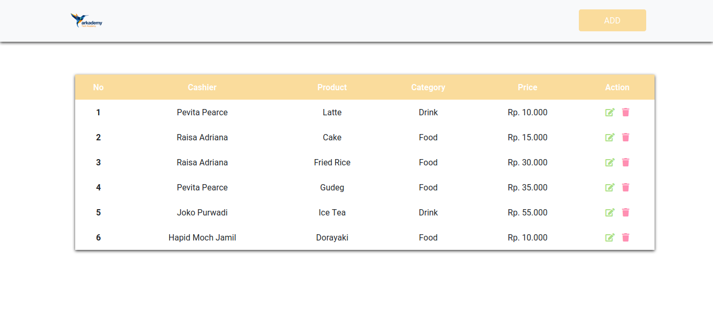
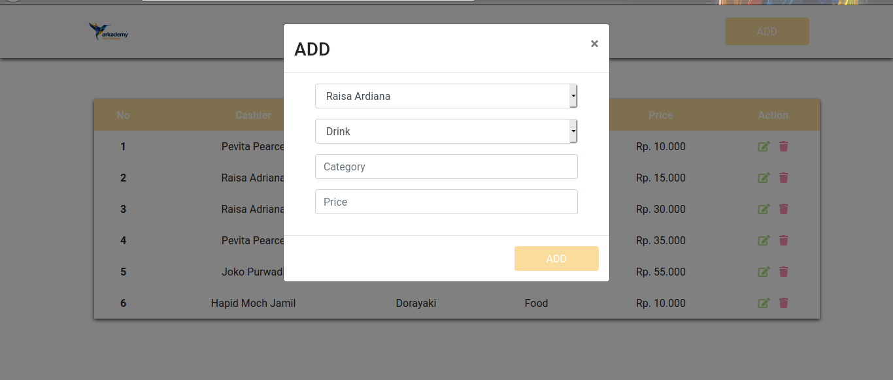
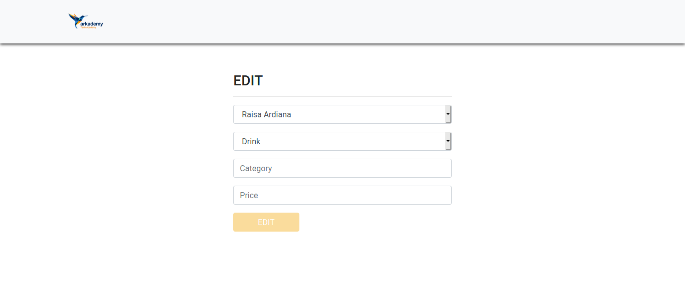
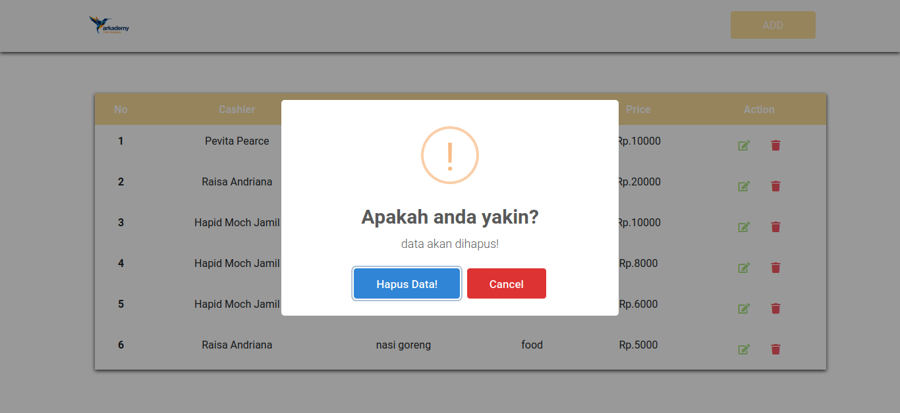

# seleksi-arkademy
 Tes Online Coding untuk Bootcamp Arkademy Batch 16
 
 Repository ini dibuat untuk keperluan seleksi Bootcamp Arkademy Batch 16

 Oleh : Rega Aji Prayogo

 REST API

  REST (REpresentational State Transfer) merupakan standar arsitektur komunikasi berbasis web yang sering diterapkan dalam  pengembangan layanan berbasis web. Pada arsitektur REST, REST server menyediakan resources(data) dan REST client mengakses dan menampilkan resource tersebut untuk penggunaan selanjutnya. Setiap resource diidentifikasi oleh URIs (Universal Resource Identifiers) atau global ID. Resource tersebut direpresentasikan dalam bentuk format teks, JSON atau XML. Pada umumnya formatnya menggunakan JSON dan XML.
 Kegunaan JSON pada REST API

  JSON digunakan untuk bertukar data antara aplikasi satu dengan aplikasi lainnya walaupun aplikasi tersebut berbeda bahasa programnya

 Untuk soal no. 1 - no. 5 saya menggunakan bahasa pemrograman Javascript yang dapat dibuka di console browser.

 Untuk soal no 6.a, querynya sebagai berikut :

  SELECT product.id, cashier.cashier_name, product.name, category.category_name, product.price FROM (product INNER JOIN       cashier ON product.id_cashier=cashier.id) INNER JOIN category ON product.id_category=category.id;

 Untuk soal no 6.b terdapat pada folder "arkademy-static"

Untuk soal no. 6.c terdapat pada folder "arkademy-crud" dan saya menggunakan Framework CodeIgniter 3 dan Bootstrap 4 CDN.

 Preview Aplikasi di Soal Nomor 6

